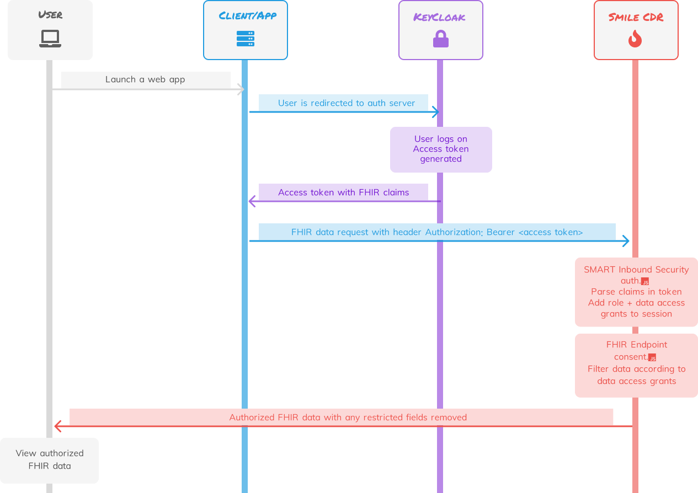

<p align="center">
  
</p>


# 👋 Welcome
This repo is a sandbox for bootstrapping and testing OIDC authentication 
using Keycloak with the Smile CDR FHIR server. It also makes use of Smile
CDR's callback scripts for defining authorization policies to control access to data.

Here is the basic architecture:

<p align="center">
  
</p>

# 👩‍💻 Quickstart

The quickstart script bootstraps the development environment, seeds the FHIR server
with data, and sets up Keycloak with clients that have been assigned FHIR 
permissions. Run this script if you want to get up and running quickly and see
how everything works.

## Setup
```shell
./bin/quickstart.sh --delete-volumes
```

If everything ran correctly, you should see this in your shell:

```shell
✅ --- Quickstart setup complete! ---
```

## Get Access Token 
Let's try getting an access token from Keycloak for the `ingest-study-client`
client. 

```shell
curl -X POST -H 'Content-Type: application/json' \
-d '{"client_id": "ingest-study-client","client_secret": "lkhZRex5E58JCjcnIKkLcT4t1Q9dw5OW"}' \
http://localhost:8081/keycloak-proxy/token
```

## Inspect Token
You should get back a response that looks like this (access token removed 
for brevity):
```json
{
  "access_token": <access_token>,
  "decoded_token": {
    "acr": "1",
    "allowed-origins": [
      "/*"
    ],
    "azp": "ingest-study-client",
    "clientAddress": "192.168.176.4",
    "clientHost": "192.168.176.4",
    "clientId": "ingest-study-client",
    "email_verified": false,
    "exp": 1681241247,
    "fhir_consent_grants": [
      "fhir-role-fhir-client-superuser",
      "fhir-consent-read-study|SD-0",
      "fhir-consent-delete-study|SD-0",
      "fhir-consent-write-study|SD-0"
    ],
    "fhir_roles": [
      "fhir-role-fhir-client-superuser"
    ],
    "iat": 1681237647,
    "iss": "http://keycloak:8080/realms/fhir-dev",
    "jti": "40b44b13-9b07-45c1-9432-ee1c17ebdab2",
    "preferred_username": "service-account-ingest-study-client",
    "scope": "fhir profile email",
    "sub": "7a25c1e2-5403-476b-ab13-00acc1693a75",
    "typ": "Bearer"
  },
  "expires_in": 3600,
  "not-before-policy": 0,
  "refresh_expires_in": 0,
  "scope": "fhir profile email",
  "token_type": "Bearer"
}

```
The actual base64 encoded access token needed to send requests to the 
FHIR server will be in `access_token` but you can see the decoded version of 
it in `decoded_token`. In the decoded version you can see the FHIR permissions 
this client has.

## View Authorized Data
Let's use the access token to view the FHIR data we are authorized to see:

```shell
curl -X GET -H 'Content-Type: application/json' \
-H 'Authorization: Bearer <put access token here>'\ 
http://localhost:8000/Patient
```

You should get back only Patients that are tagged with study SD-0 since 
this client only has access to study SD-0 data

```json
{
  "resourceType": "Bundle",
  "id": "89a5316b-5b3e-4d72-870d-b8b6fbde3a0b",
  "meta": {
    "lastUpdated": "2023-04-11T18:43:50.495+00:00"
  },
  "type": "searchset",
  "link": [
    {
      "relation": "self",
      "url": "http://localhost:8000/Patient"
    }
  ],
  "entry": [
    {
      "fullUrl": "http://localhost:8000/Patient/PT-0-0",
      "resource": {
        "resourceType": "Patient",
        "id": "PT-0-0",
        "meta": {
          "versionId": "1",
          "lastUpdated": "2023-04-11T16:27:11.482+00:00",
          "source": "#0CcOEphD4HWnDalI",
          "tag": [
            {
              "system": "urn:study_id",
              "code": "SD-0",
              "display": "SD-0",
              "userSelected": false
            }
          ]
        },
        "identifier": [
          {
            "use": "official",
            "system": "https://app.dewrangle.com/fhir",
            "value": "PT-0-0"
          }
        ],
        "gender": "male"
      },
      "search": {
        "mode": "match"
      }
    },
    ...
  ]
}
```

## View Unauthorized Data
Let's try to view datal we are NOT authorized to see (a Patient tagged 
with study SD-1):

```shell
curl -X GET -H 'Content-Type: application/json' \
-H 'Authorization: Bearer <put access token here>'\ 
http://localhost:8000/Patient/PT-1-0
```

You should get back a response that says the Patient was not found 

```json
{
  "resourceType": "OperationOutcome",
  "issue": [
    {
      "severity": "error",
      "code": "processing",
      "diagnostics": "HAPI-1995: Resource Patient/PT-1-0 is not known"
    }
  ]
}
```

# 👩‍💻 Development

## Docs
Design docs detailing auth and access control

```
docs
|-- access_control.md
|-- keycloak-access-control.md
`-- smilecdr.md
```

## Smile CDR
All server settings are located in `smilecdr/settings`

```
smilecdr
`-- settings
    |-- auth.js
    |-- consent.js
    |-- master.properties
    |-- oidc-servers.json
    |-- jvmargs.sh
    |-- system-users.json
    `-- users.json
```

### auth.js

- The post authentication callback function that Smile CDR calls once the user 
has been authenticated. This function is responsible for extracting FHIR 
roles and permissions from the access token (in the case of OIDC) or
user object (in the case of basic auth) and adding it to the user session.

- See https://smilecdr.com/docs/security/callback_scripts.html#method-onauthenticatesuccess

### consent.js

- This file has several authorization or consent functions that control what 
data is returned to the user, if any, based on the user's role and permissions.

- See https://smilecdr.com/docs/security/consent_service_javascript.html

### master.properties 

- This is the main configuration file for the server.

- See https://smilecdr.com/docs/configuration_categories for details on each 
property.

### oidc-servers.json 

- A list of configuration objects for each OIDC server that you want Smile CDR
to be aware of. Local Keycloak configuration is included.

- See https://smilecdr.com/docs/configuration_categories for details on each 
property.

### jvmargs.sh

- Sets the JVM args for Smile CDR

### system-users.json 

- Defines the admin and anonymous basic auth users that are seeded into the
server at deploy time.

### seed-users.json 

- Additional Smile CDR basic auth users that can be loaded into the server 
at runtime with the bin/load_data.py script

## Keycloak

```
keycloak
`-- settings
    |-- fhir-dev-realm.json
    |-- fhir-dev-users-0.json
```
### fhir-dev-realm.json

- Keycloak settings for the tenant "fhir-dev". These get loaded in at deploy 
time (on docker-compose up)

### fhir-dev-users-0.json

- Keycloak clients that have been configured with different FHIR roles and 
consent grants. These get loaded in at deploy time (on docker-compose up)

## Web App
- A simple Keycloak proxy that makes it easy to get an access token from 
Keycloak whether Keycloak is running in the Docker network or in an external
resolvable network.

## Utility Scripts
```
bin
|-- generate_data.py
|-- health-check.sh
|-- load_data.py
|-- quickstart.sh
|-- seed_users.py
`-- setup_dev_env.sh
```
 
### generate_data.py
- Generates sample FHIR data for experimentation

### load_data.py
- Loads sample FHIR data, generated by generate_data.py 

### seed_users.py
- Loads loads Smile CDR basic auth users 

### quickstart.sh
- One stop script to get the entire dev environment up with all sample data and users 
loaded into Smile CDR

- Calls setup_dev_env.sh 

### health-check.sh
- Pings SmileCDR health check endpoint until it is operational
